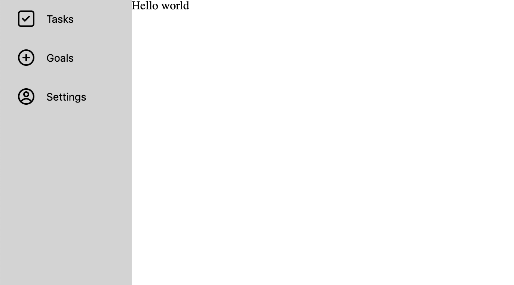
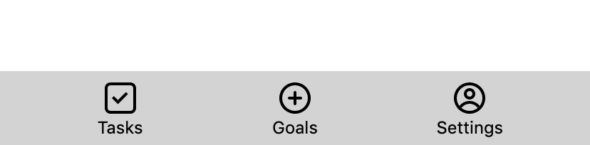

---
title: "Creating a mobile-friendly navigation component in under 100 lines of code "
date: 2020-06-04
tag: "preact"
category: "blog"
published: true
emoji: 💯
coverImage: 'https://images.unsplash.com/photo-1591256936776-5b4abed4299d?ixlib=rb-1.2.1&ixid=eyJhcHBfaWQiOjEyMDd9&auto=format&fit=crop&w=900&q=60'
---# 

As part of the [#100DaysOfCode](https://www.100daysofcode.com/) challenge, I’ve been working on creating a goal-setting app using a Rails + Preact stack. Up until now I’ve been mostly trying to wrap my head around how Rails works, but before it drove me completely crazy I decided I wanted to jump back into front-end land for a little bit. 

I wanted to begin my front-end code by building out a navigation component, as having that in place will make it easier for me to visualise how all the other components should look on the page. 

> Side note - I’m not a designer by any means, but I am trying my best 🙃

## Choosing a mobile navigation style

For full sized screens, I decided to go with the fairly standard left-hand sidebar navigation.



 But when it comes to deciding on a navigation style for mobile, I did a bit of looking around at what websites do today to decide what to do for my own app. 

Looking at DEV or Twitter on mobile for instance, both provide left sidebars that do an animated slide into view. Twitter also has a bottom navigation that contains some of the most important navigation items.

I decided against the sliding menu pattern since I didn't think that would be necessary with the amount of navigation items I needed, and instead opted to just have a bottom bar like Twitter does.



## Getting started with your Preact component

I’m using [Preact](preactjs.com/) for the frontend, which is a lightweight alternative to React. It doesn’t contain all the features that React does (you can take a look at their docs to learn more about [the differences to React](https://preactjs.com/guide/v10/differences-to-react)) but so far I haven't found any features that I'm missing from React. 

To structure our navigation component, we’re going to need a div that contains our navigation items, a div for our content, and a container div that lives around it:
```js
import { h } from 'preact';

const Navigation = () => (
    <div>
        <div>Navigation items here</div>
        <div>Hello world!</div>
    </div>
);

export default Navigation;

```

## Styling your component

To style each of our divs, I’m going to use a CSS-in-JS library called [Emotion](https://emotion.sh/docs/introduction). If you’ve never had the chance to use CSS-in-JS before, I’ve created a guide to [getting started with styled-components](https://www.emgoto.com/react-styled-components/) which should give you a quick summary of how things work. Since Emotion lets you use the same `styled` API that styled-components has, swapping between the two libraries is very easy.

We'll be putting styles in a separate `styled.js` file. For our container div, we’ll need it to expand to the full width and height of the screen, and also to reverse the order in which the sidebar and the content are displayed when being viewed on a mobile:
```js
import styled from '@emotion/styled';

const MAX_WIDTH = 480;

export const Container = styled.div`
    display: flex;
    height: 100vh;

    @media screen and (max-width: ${MAX_WIDTH}px) {
        flex-direction: column-reverse;
    }
`;

```
> If you’ve never seen @media before,  you can read them like an if statement. If the width of the browser is smaller or equal to the given max-width value, we will apply the CSS inside of the curly braces. Here we’re using it for mobile-specific CSS.

Secondly we’ll need components for our content and navigation bar. For the content, we need to make it fill all the remaining space that is not taken up by the navbar:
```js
export const Content = styled.div`
    flex: 1;
`;

```
For the navbar, we’ll set a fixed width when we’re in desktop mode, and 100% width when we’re viewing in mobile mode: 
```js
export const Navbar = styled.div`
    background-color: lightgrey;
    display: flex;
    width: 176px;
	flex: 1;

    @media screen and (max-width: ${MAX_WIDTH}px) {
        width: 100%;
		height: 52px;
    }
`;
```
We can then use these components in our app:
```js

import { Container, NavBar, Content } from './styled';

const Navigation = () => (
    <Container>
        <Navbar/>
        <Content>Hello world</Content>
    </Container>
);

```
At this point you’ll have a responsive navigation bar that moves from being on the left hand side to being at the bottom in mobile mode. 

## Adding your navigation items

Next up is adding navigation items to our sidebar. I’ve created a separate component for this, which takes in an icon and some text as props:
```js
const NavItem = ({ Icon, text }) => (
    <NavButton>
        <Icon />
        {text}
    </NavButton>
);
```
This also makes use of a new styled component we’ll need to create called `NavButton`:
```js
export const NavButton = styled.button`
`;

```

Inside of `NavButton`, we’ll need to override the default HTML button styles:
```css
border: none;
background-color: transparent;
```

We then need to make sure that in desktop mode, the icon and the text will be centre-aligned next to each other:

```css
display: flex;
align-items: center;
width: 100%;
```

Finally, if we’re viewing the navigation component on a mobile, we’ll want the icon to stack on top of the text, instead of the two living side by side:
```css
@media screen and (max-width: ${MAX_WIDTH}px) {
    flex-direction: column;
 }
```

Now that your `NavItem` component is complete, you can add it to your `Navigation` component:
```js
import HomeIcon from '../assets/homeIcon';
import GoalIcon from '../assets/goalIcon';
import SettingsIcon from '../assets/settingsIcon';

const Navigation = () => (
    <Container>
        <NavBar>
            <NavItem Icon={HomeIcon} text="Tasks" />
            <NavItem Icon={GoalIcon} text="Goals" />
            <NavItem Icon={SettingsIcon} text="Settings" />
        </NavBar>
        <Content>Hello world</Content>
    </Container>
);
```

At this point, you’ll have a mobile-friendly navigation component! Of course, there is still some styling work that needs to be done, such as increasing font size, adding padding between the icon and the text, and adding some styling on hover. I've added these changes, plus everything we've done, to a [Codepen](https://codepen.io/emgoto/pen/mdVyyBP).

I couldn’t easily get Preact + Emotion working in Codepen, so the Codepen is actually using React and styled-components, which goes to show how easy it is to swap out! 

## Conclusion

In under 100 lines of code, we’ve created a navigation component that works on both mobile and web! This navigation pattern should work for smaller apps that only need to show a handful of navigation items to their users. As your app grows in features, you may need to switch out to a sliding pattern - if you're looking for an example of how to do that, Jose Felix has written a similar guide on creating a [mobile friendly navigation with React](https://dev.to/jfelx/create-a-mobile-friendly-navigation-with-react-4930).

Thanks for reading!