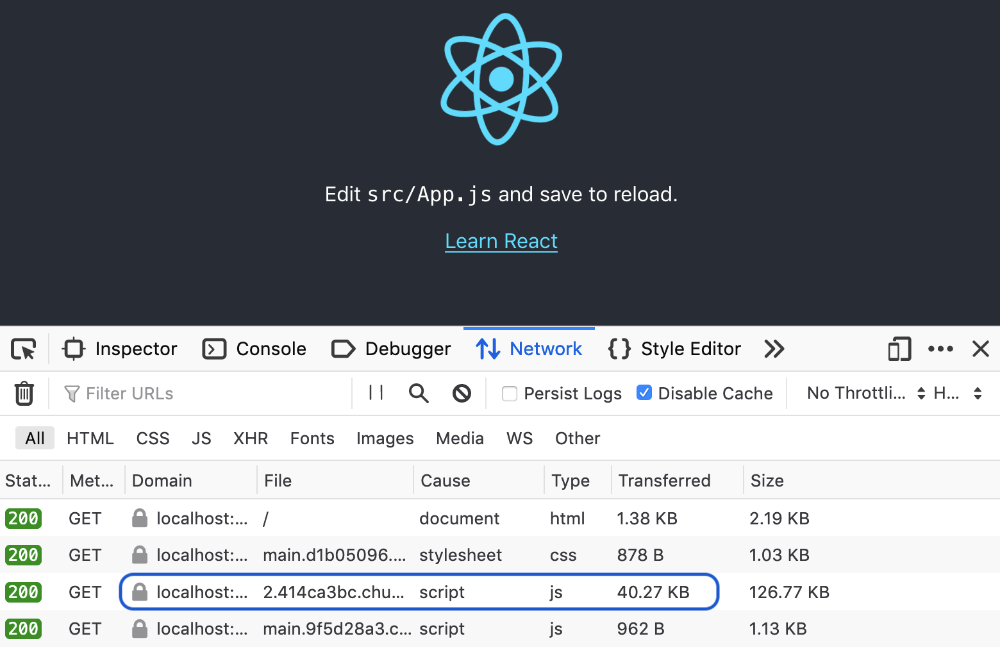
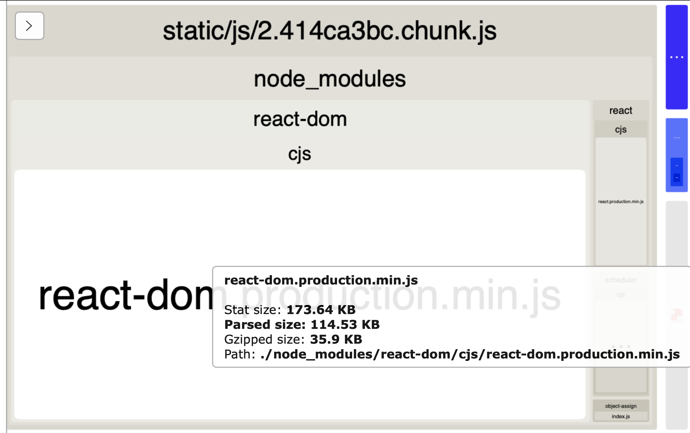
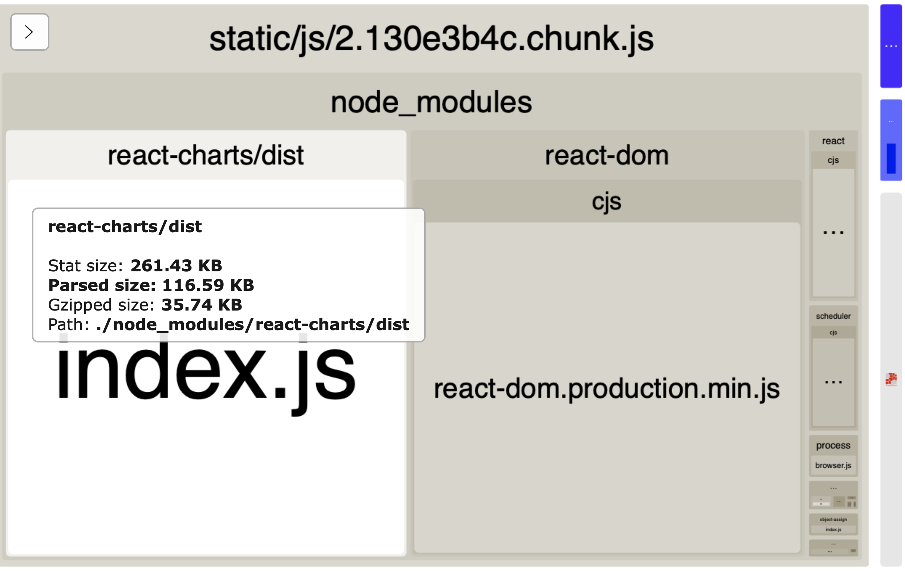
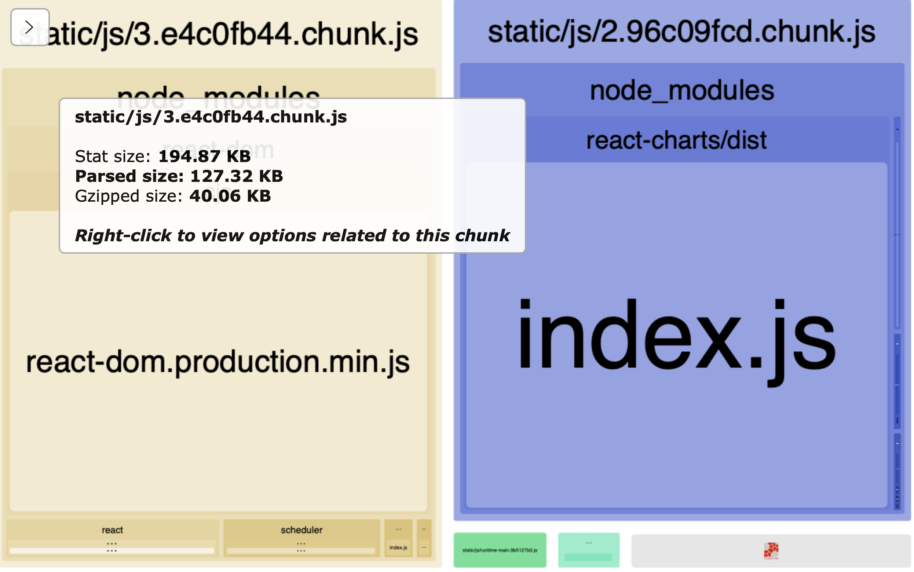
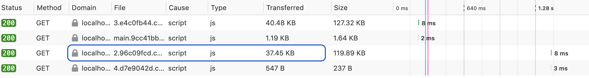

---
title: "Analyze your React app’s bundle size and cut it down using code-splitting"
date: 2020-01-10
category: "blog"
tags: ["react"]
emoji: ✂️
coverImage: ''
--- 
As your React app gets larger, you may have to start worrying about its **bundle size**. 

> An app’s **bundle size** is the amount of JavaScript a user will have to download to load your app.

The bigger the bundle size is, the longer it will take before a user can view your app. If this gets too slow, it can lead to frustration for your users, especially those with slower internet connections.

## Checking your app’s bundle size

The easiest way to see your app’s bundle size is to open the network tab in your browser devtools, and load your app. You should see two JavaScript files being loaded:



The much smaller one contains actual code that we've written, while the larger one (which I've highlighted) contains the code for all the libraries living in our `node_modules` folder. 

The **transferred** value is the amount the user has downloaded, while the **size** value is the true value after it has been unzipped. 

> The bundle size in development mode will be much larger than in production mode, so don’t get too scared if it looks huge!

## Analyzing your bundle

If you're not sure why your bundle is so big, there are a couple of tools that can help you to visualise what libraries make up your bundle.

If you’re using `create-react-app`, it only officially supports using [source-map-explorer](https://www.npmjs.com/package/source-map-explorer), which you can set up using [their guide](https://create-react-app.dev/docs/analyzing-the-bundle-size/).

However I think that the [webpack-bundle-analyzer](https://www.npmjs.com/package/webpack-bundle-analyzer) is the better tool for analyzing bundles, and if you're interested there's currently a [workaround](https://medium.com/@romanonthego/webpack-bundle-analyzer-for-create-react-app-9aebb0d01084) to get it working with `create-react-app`.

## Using webpack-bundle-analyzer

This is what the `webpack-bundle-analyzer` will create for a fresh `create-react-app`:



From top to bottom - we can see the name of the bundle (which will match what you see in the network tab), and then the `node_modules` folder. Inside of that you can see that `react-dom` takes up the majority of the bundle size and then `react` takes up a much smaller amount on the right.

> The **gzipped** size of the bundle will be the same as the **transferred** size that you saw in the network tab

## Reduce your bundle size by code-splitting

Instead of keeping all your code in the one bundle, you can split it up into multiple bundles to be loaded separately. This is known as **code-splitting**.

If your app has multiple pages, an easy candidate for code-splitting is to split up the code by each page. So when the user is on the home page, the bundle that is loaded only contains the code for the home page. When they navigate to the settings page, it will load the code for the settings page, and so on.

If you have a fairly complex page that takes a long time to load, you may need to code-split on the one page. Finding functionality that isn’t immediately needed when a user loads the page (and is expensive to load) may be a good place to start. 

In this example, we have a chart that is only shown when you click the “Generate chart” button:

```jsx
// App.js
import React, { useState } from 'react';
import { Chart } from 'react-charts';

export default function App() {
    const [showChart, setShowChart] = useState(false);
    const onShowChart = () => setShowChart(!showChart);
    
    return (
        <>
            <button onClick={onShowChart}>Generate chart</button>
            {showChart && <Chart />}
        </>
    );
}
// The chart code has been simplified for purposes of this guide
```

After adding [react-charts](https://www.npmjs.com/package/react-charts) to our app, this is what our bundle will look like: 



We can see that where `react-dom` used to take up most of the page, `react-charts` takes up just as much space (which makes sense since both libraries are about the same size).

## Code-splitting using React.lazy and Suspense

To code-split the chart into its own bundle, we'll be using React’s  `lazy` function and `Suspense` component.

One caveat is that `React.lazy` only works on default imports, and right now we’re importing `Chart` as a named import. So first we need to create a separate file that will be responsible for importing `Chart` and exporting it as a default:

```jsx
// Chart.js
import { Chart } from 'react-charts';
export { Chart as default };
```
 
Now in our main file, we can lazily import `Chart` from the new file we just created:
```jsx
// App.js

// Before
import { Chart } from 'react-charts';

//After
const Chart = lazy(() => import("./Chart.js"));
```

The code wrapped by `lazy` (in this case the `Chart` library) will be downloaded in a separate bundle at the moment it is required - which is when the user presses the button to show it.

Then we wrap our chart in the `Suspense` component, which allows us to show a loading state while we're downloading this new bundle.
```jsx
// App.js 

return (
    <>
        <button onClick={onShowChart}>Generate chart</button>
        {showChart && 
            <Suspense fallback={<>Loading...</>}>
                <Chart />
            </Suspense>
        }
    </>
);
```

Now when we open the bundle analyzer we can see that we have two separate bundles:



And to be doubly sure that these bundles are being downloaded separately, we can go back to our network tab, and see that the bundle containing the chart (on the third row) only gets downloaded after you click the button.



## One final thing - unused imports and tree-shaking

If you import a library but don’t use it, by default it will still be included in your bundle! Leaving unused imports in your file is never recommended (and should be caught out by your linter anyway) but if you did happen to leave some in, you can prevent it from getting added to your bundle by using tree-shaking, which you can read about [here](https://webpack.js.org/guides/tree-shaking/).

----------

And there you have it! To learn more about code-splitting, the React docs provide [a great guide on it](https://reactjs.org/docs/code-splitting.html) which I’d recommend checking out. This is my first technical guide, so I'd love to hear your feedback if I've under-explained or over-explained anything. Thanks for reading!
