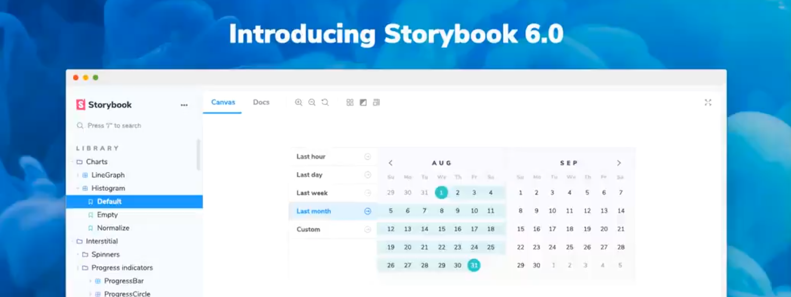

Showcasing how MDX for Gatsby.js works ... 

The Counter component is imported explicitly, but since we are using MDXProvider, we can also define global components which don't need to be imported (e.g. Link, YouTube).

## weee

Ahhhhh. **This** is a _hold-up_. <a href="">Yes!</a>.

```jsx:title=example-file.js
// Wow this is a comment
const foo = () => {
    console.log('oh yes');
    const bar = 'String!';
    return 'yeet';
}
```
Uh huh

```jsx
// Wow this is a comment
const foo = () => {
    console.log('oh yes');
    const bar = 'String!';
    return 'yeet';
}
```

And then and then and then 



### One two three
Yes!!!

> This is a blockquote! Oh yes!

Thanks for reading!

