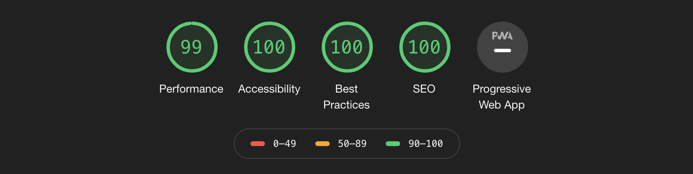
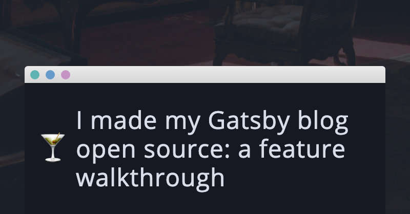

I recently [open-sourced my blog](https://github.com/emgoto/emgoto.com) built using [Gatsby](https://www.gatsbyjs.com/)! This post will walk you through why I chose Gatsby, the Gatsby plugins I used, as well as highlight some features that I have included in my blog.

## Why use Gatsby?

One of the biggest pros of Gatsby is its ecosystem. There’s an endless number of plugins to add the features you need, as well as plenty of [templates](https://www.gatsbyjs.com/starters/?v=2) to get you started. 

Another important benefit is performance. Out of the box, you’re going to get a lightning-fast site, which in turn will boost your SEO. For reference, my site gets a near-perfect [Lighthouse](https://developers.google.com/web/tools/lighthouse) score with Gatsby:

Gatsby blogs are built using React and GraphQL, so if you happen to be a React developer (like me) this is also a great plus to be able to build your site with a technology you feel comfortable with.

## Using Markdown with Gatsby
I love Markdown, and Gatsby lets me write all of my blog posts with it. Gatsby’s [official blog template](https://www.gatsbyjs.com/starters/gatsbyjs/gatsby-starter-blog) is a great way to get started with this.

If you’re looking for something a bit more powerful than Markdown, Gatsby also provides support for [MDX](https://mdxjs.com/). With MDX, you’re able to write your posts in Markdown, and then also add in JSX components wherever you like.

Although my site only uses Markdown at the moment, I based my site off this [mdx-blog-starter](https://github.com/rwieruch/gatsby-mdx-blog-starter-project) so that I have the flexibility to add JSX to my posts down the road if I choose.

## Gatsby plugins
If you’re looking for a feature to add to your site, chances are there exists a plugin that will do it for you. A few notable mentions:
* `gatsby-plugin-google-analytics` if you’re looking to add Google Analytics to your site
* `gatsby-remark-external-links` makes sure that external links in your Markdown will open in a new tab
*  `gatsby-plugin-feed` for an RSS feed (which comes in handy when you want to cross-post to DEV!)
* `gatsby-remark-autolink-headers` will add the ability to link to subheadings on your page (you can see it if you hover over one of the headings on this post) 

## Social cards with Gatsby
Social cards are the images you see when you share a link to your blog on sites like Twitter or Facebook. This is what the social card looks like for this post:

There are a couple of plugins that will generate social cards for you, however they are slightly limited in their design and functionality. I instead opted to [modify a script created by Max Poutord](https://github.com/maxpou/gatsby-starter-morning-dew/blob/master/scripts/generatePostPreviewImages.js) that lets me create a React component for my social card, and take a screenshot of it.
## Newsletter sign-up prompt
Everyone recommends that you should have a newsletter, so I’ve added a component to the bottom of each blog post that gives readers the option to subscribe. I decided to go with [buttondown.email](https://buttondown.email/) as it was the cheapest option I could find, compared with some of their competitors. 
I’m yet to release my first newsletter, but I am thinking of making it a monthly roundup of my posts and what I’ve been up to. Feel free to [subscribe](https://buttondown.email/emgoto) if you are interested!
## Web monetisation with Gatsby
During DEV’s web monetization hackathon a couple of months back, I wrote a post on how to set up [web monetization with Gatsby](/gatsby-web-monetization/). Essentially, web monetization means that if people visit my site, and they’re subscribed to a service like [Coil](https://coil.com/), I will receive a small amount of money (fractions of a cent) depending on the amount of time they visit my site.
It’s super simple to set up. I’ve only made $5 so far, but I think the idea behind it is pretty cool.
## Each post links to its Markdown file
Now that my blog is open source, I can give readers the opportunity to make contributions to my site. At the top of each post, I have a link to its Markdown file on Github. If you happen to notice a typo while reading one of my posts, you’re welcome to open a pull request on Github to fix it!
## Hosting Gatsby on Netlify
For hosting, I use [Netlify](https://www.netlify.com/). It’s very user-friendly, and it’s free! Each time I push to my blog’s repository, it will automatically trigger a new deploy and my site will be ready in minutes.
## What’s next?
Updating my blog has been kind of addictive, and there’s a couple more features that I’m planning on adding:
* Better code snippets
* Integration with DEV using its API

I think this blog overhaul has rejuvenated my interest in writing posts, and so I’m excited to see what the following months will bring. Stay tuned!