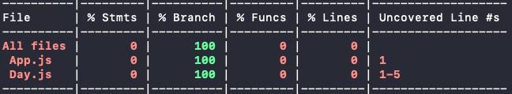
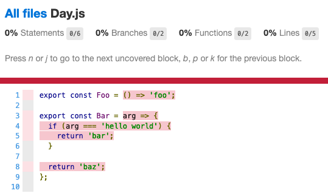

---
title: "Understanding code coverage with Jest"
date: 2020-04-18
tags: ["jest"]
category: "blog"
emoji: ☔
coverImage: 'https://images.unsplash.com/photo-1519692933481-e162a57d6721?ixlib=rb-1.2.1&ixid=eyJhcHBfaWQiOjEyMDd9&auto=format&fit=crop&w=1050&q=80'
--- 

Your app's **code coverage** is a metric you can use to see what percentage of the code is currently covered by unit tests. It's a useful tool you can use to find any code paths in your app that you may have missed in your tests.

Incidentally, I've also found code coverage to be a fun motivator when writing unit tests. I don't generally enjoy writing them, but watching that coverage percentage go up and up makes the process of writing unit tests more enjoyable for me.

## Calculating your code coverage

Seeing your code coverage can be as simple as adding the `--coverage` flag when running your Jest unit tests:

```bash
yarn test folder/name --coverage
```

However when you run your Jest tests using only the `--coverage` flag, coverage is calculated for **each file that is covered in a test** (and any other files that they are importing).

This means that if you had the following files:

- `Foo.js`
- `Foo.test.js` (tests the code from `Foo.js`)
- `Bar.js`

The lack of unit tests for `Bar.js` wouldn't actually decrease your test coverage - Jest would report that you have 100% code coverage even if all the code in `Bar.js` was untested! 

By adding the `--collectCoverageFrom` flag, it tells Jest to calculate code coverage for *all* files that you specify, even those that are not covered by tests:

```bash
yarn test folder/name --coverage --collectCoverageFrom='folder/name/**/*.js'
```

After you run the coverage command you’ll get a summary that looks like this:



## Using the coverage report

If you'd rather see your results visually, you can run the following command to create a coverage report:

```bash
yarn test folder/name --coverage \
--coverageDirectory='coverage' --collectCoverageFrom='folder/name/**/*.js'
```

This command will generate an HTML report in the folder you specified in the `--coverageDirectory` flag. If you open up the `index.html` file in your browser, you’ll be able to see which lines are not covered, which will be highlighted in red:



## The pitfalls of aiming for 100% coverage

As you increase your code coverage, you may come across scenarios where certain lines of code are not easily coverable by unit tests. Spending your time trying to find some sort of workaround to cover a line of code just for the sake of reaching that 100% coverage goal is never worth it. There are much better things you could be spending your time on!

Even if you do "cover" a line of code, there's no guarantee that it will be perfect and bug-free, either. If we take a look at a `double` function that doubles the number you pass in:

```js
const double = (number) => 2;
```

Testing `double(1)` would pass, and would be all that is required to reach 100% coverage - but that function will fail with all other numbers.

Code coverage can be useful, but it's important not to use it as the only metric to measure the effectiveness of your unit tests. You will still need to keep in mind all your edge cases and different scenarios that may pop up in your code, which won't be picked up by code coverage.

Thanks for reading!