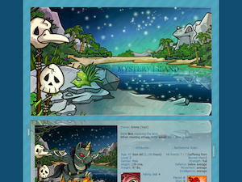
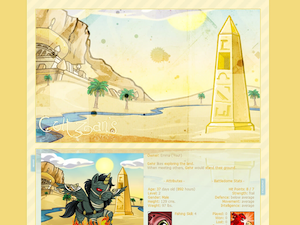

---
title: "Nevertheless, Emma coded"
date: 2020-03-06
tags: ["career"]
category: "blog"
emoji: 👩‍💻
coverImage: ''
--- 

In celebration of International Women’s Day, here’s a quick post about my journey into tech!

## How it all started

For me, it all started when I was about 11 or 12 with Neopets, where you could create little profiles for your virtual pets using HTML and CSS. I really enjoyed doing this - to the point where I was actually running my own site that provided custom profiles for other people. They usually involved a stock image from Neopets, then I would sprinkle a bunch of Photoshop effects on top:

*Sorry, the images aren't aligned very well. I need to switch from using md to mdx for Gatsby!*

I eventually grew out of Neopets, and got too busy with school to run the site. Unfortunately at that time I never branched out beyond HTML and CSS - I had *heard* of PHP (and maybe JavaScript) but I never tried learning it because what I wanted to accomplish didn’t really need it.

## 2014: Entering university

Fast forward until the end of high school, and I didn’t really know what I wanted to do with my life. Australia has a pretty good education system (you’re loaned money from the government for your degree and you don’t have to pay it back until you earn a certain amount) so I definitely wanted to go to university, but I wasn’t sure for what. 

I decided to do a software engineering degree because I wasn’t too bad at math, heard engineers make decent money, and I liked playing video games so “software” engineering sounded like the best type of engineering to me. 

Our introductory course had us learning in C and I really struggled and had no clue what I was doing (I could not for the life of me understand pointers), and was doubting whether I was cut out to be a programmer. But in my second semester, I did a course in Perl where we got to build our own website, and that’s when everything started to click for me. 

Long story short, I did a couple of internships (doing some Python and .NET), ended up graduating with a computer science degree, and started a job as a graduate developer at Atlassian, where I still work today. At uni our courses were pretty outdated so we didn’t get to learn any of the new shiny front-end frameworks, so it wasn’t until Atlassian that I really started getting into learning React.

## 2019: Starting side projects

For a long while I was the kind of person that didn’t do any side projects. Especially during uni, I didn’t really have any ideas for what I wanted to build, and to be honest I didn’t really have the passion or the desire to do it either. I think at that point I also lacked the confidence to think of myself as a “real” developer and just stuck with what I needed to do for my uni coursework. Even once I entered the workforce I just programmed in my day job and then went home and played video games or did other hobbies unrelated to programming. I always looked up to people who did cool side projects though, and wondered how they managed to do it.

I’m not sure now how I realised Trello Power-Ups were a thing, but for me that’s what has really kickstarted this whole side project journey (I have so many ideas now!). Releasing my first Trello Power-Up, [Streak](/streak), into the wild and getting some users has been really rewarding and given me a lot of satisfaction, to the point where now I’ve released three Power-Ups.

## 2020: Building an online presence

2020 has been the year that I’ve realised I should properly jump onto this whole Twitter and DEV thing, and think about having an online presence and let people know that hey, I exist! So far in 2020 I’ve written a blog post every week, as well as released my [third Trello Power-Up which integrates with your Steam account](/gaming-backlog). 

As for what’s next, I’ve got some ideas for side projects in the works, so it’ll be a matter if seeing whether they pan out or not. I’m also considering branching out into learning a new language or framework like Ruby on Rails.

The DEV community has been super welcoming so far, and I will definitely be keeping this blog-writing streak going for a while longer. 

Thanks for reading!

