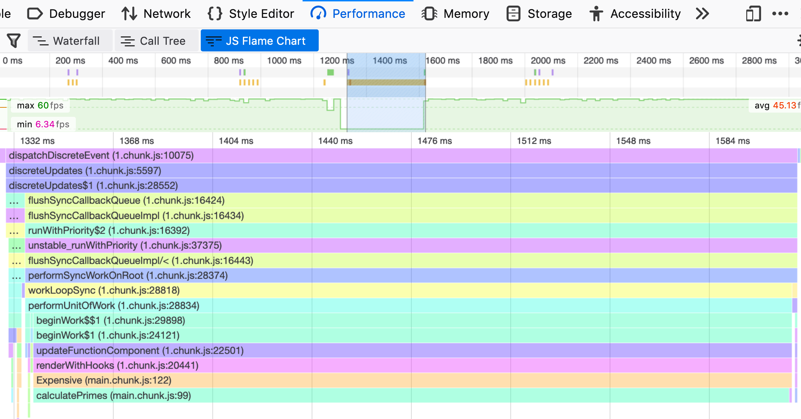

---
title: "Use memoization in your code to reduce unnecessary re-renders"
date: 2020-01-17
category: "blog"
tags: ["react"]
emoji: 🔥
coverImage: ''
--- 

**Memoization** is the act of storing the result of an expensive function call, and re-using the result whenever it’s required, instead of re-calculating it unnecessarily. It’s not something you’ll need to use every day, but something to keep in mind if you’re looking for ways to improve the performance of your React app. 

## Finding problems using flame charts 🔥 
Before diving straight into adding memoization to your app, it’s good to diagnose where your app’s performance issues are coming from. One of the things you can do is to go over to your browser’s Performance tab and record your app’s performance as it renders.



What you’re seeing here is a flame chart in the Firefox browser (you’ll see something similar in Chrome). Up the top is a complete timeline of what happened during your recording, and the darker blue bit is the section of the timeline that I’ve selected. All the colorful bars are what’s happening in our app in that selected section of the timeline.

In this scenario I’ve pressed a button on my React app at about the 1250ms mark - and the framerate *tanks* (as you can see by the green line dropping at the top). We can see the root cause (at the bottom of the screen) is a [calculatePrimes](https://developer.mozilla.org/en-US/docs/Tools/Performance/Scenarios/Intensive_JavaScript) function happening inside of an `Expensive` component. 

This is what the code looks like:

```jsx
const Expensive = ({ value }) => {
  const primes = calculatePrimes(value, value) // does a lot of math
  return <>{primes}</>
}

const App = () => {
  const [count, updateCount] = useState(0)
  return (
    <>
      <button onclick={updateCount(count + 1)}>Click</button>
      <Expensive value={100} />
    </>
  );
}
```

By default, when a parent component re-renders, all of its children components will re-render too. So in this case, each time someone clicks the button (and changes the state of `App`, causing it to re-render), `Expensive` will also re-render and call `calculatePrimes`.

Considering the fact that we are passing the same prop in to `Expensive` each time, `calculatePrimes`  is going to return the exact same output each time. It doesn’t really *need* to be re-rendered, and so there is an opportunity here to memoise the component.

## Memoize components using React.memo()
We can make a component only re-render once its props have changed by wrapping it in `React.memo`:

```jsx
const ExpensiveMemo = memo(function Expensive({ value }) {
  // ...
});

function App() {
  const [count, setCount] = useState(0)
  return (
    <>
      <button onClick={() => setCount(count + 1)}>Click</button>
      <ExpensiveMemo value={100} />
    </>
  );
}

```

Since `ExpensiveMemo`'s `value` prop will always be `100`, it will render once when the page initially loads, and then never re-render again. 


> If you’re using class components, using [React.PureComponent](https://reactjs.org/docs/react-api.html#reactpurecomponent) will achieve the same effect.

## Watch out for your props!
In the above example, the prop we’re passing in is a number. But what if we passed in an object or an array?

```jsx
<ExpensiveMemo value={['hello', 'world']}/>
```

Doing this will cause the `Expensive` component to _always_ re-render, as we’re creating a new array and passing it in each time.

On the other hand, if you modified an already-existing array and passed it in as a prop:

```jsx
const countArray = [];
function App() {
  //...
  countArray.push[count]
  return (
    // ...
    <ExpensiveMemo value={countArray}/>
```

That would *never* cause a re-render, as React `memo` only does a shallow comparison on its props, which means that it only cares that `countArray` is the same array (and not what’s inside of it).

> To fix this, you can pass in your own custom `areEqual`  function as a second argument to `React.memo`.

## Memoize values using React.useMemo()
Instead of worrying about whether we’re going to cause `ExpensiveMemo` to re-render or not, alternatively we can just memoize the expensive `calculatePrimes` function using the [React.useMemo](https://reactjs.org/docs/hooks-reference.html#usememo) hook:

```jsx
const Expensive = ({value}) => {
    const primesMemo = useMemo(() => calculatePrimes(value, value), [value]); 
    return <>{primesMemo}</>
}
```

The first argument we pass into `useMemo` is the function to calculate the value that we want. The second is an array of its dependencies (things that if they change, we will want to recalculate the value) which in our case is just the `value` prop.

Now `calculatePrimes` will only get called whenever `value` changes!


> If you’re using class components, there are libraries out there that accomplish the same thing as `useMemo`, such as [memoize-one](https://github.com/alexreardon/memoize-one).


## Conclusion
If your app is fairly small or doesn’t have any expensive calculations, memoizing things in your code will add more code and complexity without actually providing any performance benefit so it’s not something I’d advise using - but I think it’s definitely a good thing to keep in mind especially as your app grows bigger. 

Thanks for reading!

