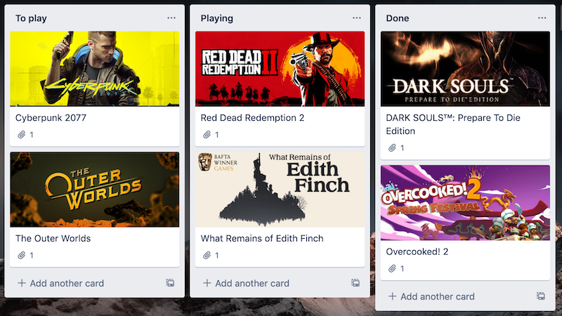
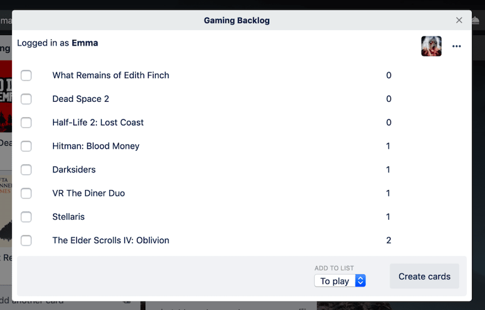

import Seo from '../../components/seo'

<Seo title="Gaming Backlog"/>

# Gaming Backlog

[Gaming Backlog](https://trello.com/power-ups/5e32b07c80a9cd1d0e7e5e8e) allows you to connect to your Steam account and easily bulk-add games as cards to your Trello board 🎉

I can’t guarantee that using this will make your backlog any smaller, but it will make for a very pretty-looking Trello board that you can stare at when you’re looking for something to play.

## Troubles with authentication and Steam

This side project turned out to be a lot harder than I thought it would be (don’t they always). I was rendering everything in an iframe on the Trello board, but Steam authentication won’t run in an iframe (I assume for security reasons) so I had to pop open a new window, have the user authenticate, and then redirect back to the Trello board.

I detailed some of the authentication gotchas in another post here:

[Setting up Steam Authentication using OpenID](https://emgoto.com/steam-auth-and-openid).

 One of my biggest surprises is that authenticating with Steam doesn’t really grant you _anything_. It returns you the user’s SteamID, but this ID is public information that you can get from a Steam user’s profile. The only benefit it really provides is a “smooth” way of getting a user’s ID, instead of making them jump through hoops to get it for you. Unfortunately that also means when you call the Steam API to grab a user’s games, their profile needs to be public. Luckily most people seem to leave their profiles public by default, so I'm hoping this isn’t too big of an issue.

## Architecture
Everything that renders on your Trello board is from a static site I hosted on Github Pages, while the authentication flow and the calling of the Steam APIs is handled by an Express.js app hosted on Heroku. Could I have done this all on the one app? Yes, but to be honest I don’t really know what I’m doing so my Express.js code is like a house of cards that I'm afraid could fall down at any second! I don’t trust my free Heroku plan to give me 100% uptime either, or to be very fast, so I split it out into two apps to try and mitigate this risk if it does go down.

## What’s next?
For now I will leave this Power-Up as is and see if it gets much usage. The Steam API does provide a way to grab a user’s achievements for a particular game, so the next feature I might add is the ability to add your achievements as a checklist on your Trello card.
