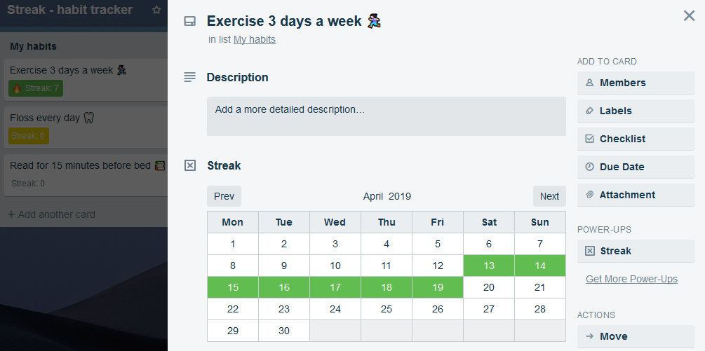

import Seo from '../../components/seo'

<Seo title="Streak" />

# Streak - habit tracker for Trello

Streak is a Trello Power-Up that allows you to track habits straight on your Trello board.

You check off that you've completed your habit using the calendar on the Trello card, and then you can see at a glance how you're tracking across all your habits with the little badges on the front of the cards.

This is my first Trello Power-Up (and first proper side project, too). It's being hosted for free on Github Pages.

You can check it out via [Trello's Power-Ups directory](https://trello.com/power-ups/5c02759abbb4b58f5d5d2526/streak-habit-tracker).

If you have any feedback or feature suggestions for Streak, I'd love to hear from you! You can contact me [via Twitter](https://twitter.com/emma_goto).
